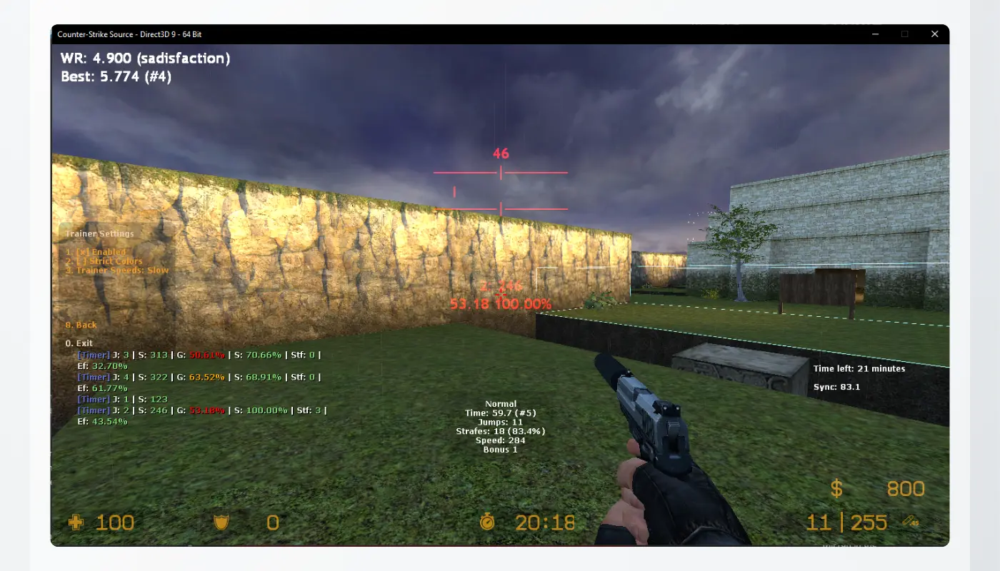
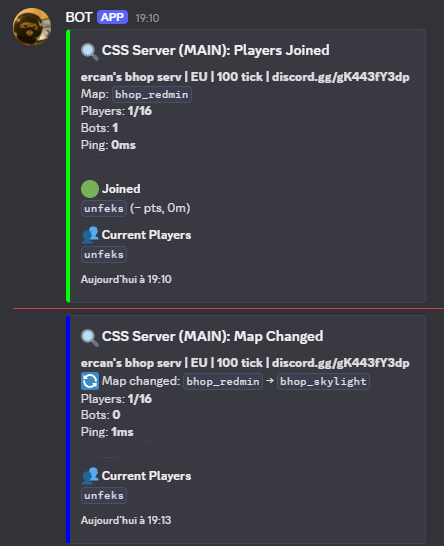

# 🕹 Counter-Strike: Source Bhop Server Setup with Docker

- Auto-installed Bhop server plugins (Metamod, Sourcemod, Shavit Timer, etc.)
- Docker containerization for easy setup and portability
- 100-tickrate enforced for smooth bunnyhopping
- Works locally or for remote server deployment
- Includes a few starter maps — add your own, use !zones to configure
- Pre-made zones/tiers for 10000 maps



## 🚀 Setup Instructions

### Prerequisites

- Docker (https://docs.docker.com/get-started/get-docker/) + WSL (Take Ubuntu)
- Git (optional)

Clone the repository:

```bash
git clone https://github.com/iErcann/Docker-Bhop-CSS
```

or download zip and extract it to a folder

### 1️⃣ Customize Server Settings

Edit the server configuration file to personalize your setup:

**File Path:** `cssserver.cfg`

Example configuration:

```plaintext
hostname "Bhop Server"                # Server name
rcon_password ""                      # Secure RCON password or disable
sv_setsteamaccount "your_token_here"  # Steam Game Server Login Token, only needed if you want to be in the server browser

// Force 100 ticks
sv_mincmdrate 100
sv_maxcmdrate 101
sv_minrate 100000
sv_maxrate 0
sv_minupdaterate 100
sv_maxupdaterate 101

```

> **Tip:** Generate a Steam Game Server Login Token (GSLT) at [Steam Game Server Account Management](https://steamcommunity.com/dev/managegameservers).

### 2️⃣ Start the Server

Launch the Docker container to initialize your Counter-Strike: Source server:

```bash
docker-compose up
```

Wait for all services to start. The server will run in the foreground.

> Could take some time if running first time.

> To run it in the background, use `docker-compose up -d`

### 3️⃣ Configure as a Bhop Server

#### 🔍 Verify Server Status

Check the server's current status and details:

```bash
docker exec -it --user linuxgsm css-server ./cssserver details
```

---

#### 🧰 Install Bhop Plugins

Set up the server with essential plugins like Metamod, Sourcemod, and a Bhop Timer:

```bash
docker exec -it --user linuxgsm css-server bash /init.sh
```

This script will install the required plugins for a Bhop server:

- MetaMod:Source
- SourceMod
- Shavit's Bhop Timer
- bhop-get-stats
- Tickrate Enabler
- RNG Fixer
- 260 Velocity Fix for Weapons (so we don't need to drop them)
- Bash2 AntiCheat
- Show Clips
- Show Triggers
- LandFix with Hud and Cookies
- Gap

---

#### 🔍 Verify Plugin Installation

Access the game server console:

```bash
docker exec -it --user linuxgsm css-server ./cssserver console
```

Run the following command to confirm Metamod and Sourcemod are loaded:

```
meta list
```

```
sm plugins list
```

---

### 4️⃣ Find Your Server IP Address

To connect to your server, you'll need its IP address. This is especially important if you're running Docker locally, as the server IP will typically be something like `172.17.x.x` (not `127.0.0.1`).

#### 🔍 How to Find the IP

1. **Check your network interfaces**  
   Run the following command to list your network interfaces and their IP addresses:

   ```bash
   ifconfig
   ```

   Look for the `inet` address under the `docker0` interface (for Docker containers) or your main network interface (commonly `eth0`).

2. **Examples:**

   - **On Windows (WSL):**  
     

   - **On Linux:**
     ```
     docker0: flags=4099<UP,BROADCAST,MULTICAST>  mtu 1500
                inet 172.17.0.1  netmask 255.255.0.0  broadcast 172.17.255.255
     ```

> **Tip:** Use the `inet` address (e.g., `172.17.0.1`) to connect to your server from your local machine or LAN.  
> For remote access, ensure your firewall and port forwarding settings allow external connections.

---

### 5️⃣ Add Admin Privileges

#### 📝 Edit the Admin File

Use this pre-made command to edit the file directly using `vi`:

```bash
docker exec -it --user linuxgsm css-server \
vi /app/serverfiles/cstrike/addons/sourcemod/configs/admins_simple.ini
```

#### ➕ Add Your Admin Entry

Add your Steam ID in this format (replace with your actual Steam ID):

```
"STEAM_0:0:12345678" "z"
```

#### Key Components:

- `STEAM_0:0:12345678`: Your Steam ID ([find yours here](https://steamid.io))
- `z`: Full admin privileges flag

#### 🔄 Apply Changes

After saving the file:

1. Restart your server, **OR**
2. Run this in-game command:

```bash
docker exec -it --user linuxgsm css-server ./cssserver console
```

```
sm_reloadadmins
```

> Use `"a"` instead of `"z"` for basic admin rights
> To give only !zones to someone, give him only the `"m"`.
> Disable RCON.

---

### 6️⃣ Creating Bhop Timer Zones

On all maps, you must create start and end zones for the bhop timer to work.
To do this, type the commands in the chat:

`!zones` - This will enable zone editing mode. (https://github.com/shavitush/bhoptimer/#shavit-zones-required)
`!noclip` - This will allow you to fly and move through walls to go to the end.

```
Player commands:
!set, !setstart, !ss, !sp, !startpoint - Set your current position as the teleport location on restart.
!deletestart, !deletesetstart, !delss, !delsp - Delete your spawn point.
!drawallzones, !drawzones - Draws all zones (if the server has the cvar for this enabled).

Admin commands: (RCON flag)
!zones, !mapzones, !addzone - Opens the mapzones menu.
!deletezone, !delzone - Delete a mapzone.
!deleteallzones - Delete all mapzones.
!modifier - Changes the axis modifier for the zone editor. Usage: !modifier <number>
!addspawn - Adds a custom spawn location.
!delspawn - Deletes a custom spawn location.
!zoneedit, !editzone, !modifyzone - Modify an existing zone.
!setstart, !spawnpoint, !ss, !sp - Set your restart position & angles in a start zone.
!tptozone - Teleport to a zone.

Admin commands: (ROOT flag)
!reloadzonesettings - Reloads the zone settings.
```

### 📜 Credits

- [LinuxGSM Sourcemod Guide](https://docs.linuxgsm.com/guides/sourcemod-csgo-server)
- [Bhop Stats](https://github.com/enimmy/bhop-get-stats)
- [Bhop Timer](https://github.com/shavitush/bhoptimer)
- [RNGFixer](https://github.com/jason-e/rngfix)
- [Bash2 AntiCheat](https://github.com/enimmy/bash2) (this one has .smx, but always require SteamWorks to work)
- [Tickrate Enabler](https://github.com/idk1703/TickrateEnabler) (fork, because broken)
- [LandFix](https://github.com/tadehack/landfix_wHudAndCookies)
- [Show Clips](https://github.com/GAMMACASE/ShowPlayerClips)
- [Show Triggers](https://forums.alliedmods.net/showthread.php?t=290356)
- [Weapon PreSpeeds velfix](https://forums.alliedmods.net/showthread.php?t=166468)
- [Gap](https://github.com/Nairdaa/gap)
- [Line](https://github.com/enimmy/shavit-line-advanced)
  - Requires : https://github.com/rtldg/sm_closestpos

---


## Discord Monitoring

## 📁 `/monitor` – Game Server Monitor



### 🔧 Features

- Tracks **player activity**: who joined or left
- Alerts on **map changes**
- Supports multiple game servers using [GameDig](https://github.com/gamedig/node-gamedig)
- Built with **TypeScript & Bun**
- **Dockerized**

For more details, see [`/monitor/README.md`](monitor/README.md).
