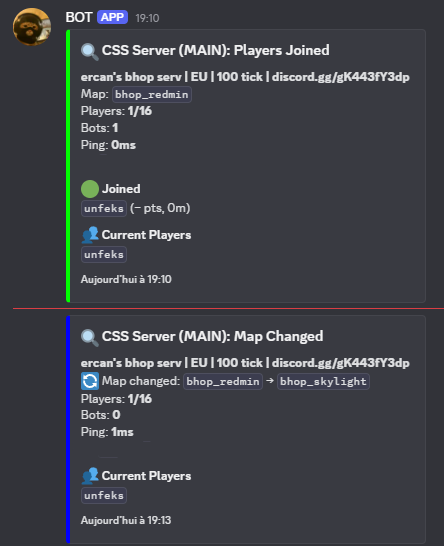

# 🎮Game Dig - Discord Game Server Monitor

A lightweight configurable server monitor that tracks game server status (player joins, leaves, map changes) and sends live updates to Discord via webhooks.



---

## 📌 Features

- ✅ Tracks **player activity** (joins/leaves)
- 🔁 Notifies on **map changes**
- 🧩 Supports multiple game servers (via [GameDig](https://github.com/gamedig/node-gamedig))
- 🔄 Configurable poll interval
- 🚀 Built with TypeScript & Bun
- 🐳 Fully Dockerized for easy deployment

---

## ⚙️ Configuration

This app uses environment variables for configuration. Below is a list of supported variables:

| Variable              | Description                                         |
| --------------------- | --------------------------------------------------- |
| `DISCORD_WEBHOOK_URL` | Your Discord webhook URL                            |
| `SERVERS_JSON`        | JSON array of servers to monitor                    |
| `POLL_INTERVAL`       | Polling interval in milliseconds (default: `10000`) |

### Example `.env` file

```env
DISCORD_WEBHOOK_URL=https://discord.com/api/webhooks/your/webhook
POLL_INTERVAL=10000
SERVERS_JSON=[{"id":"MAIN","type":"css","host":"172.17.0.1","port":27015},{"id":"BHOP_ARCANE_V2 ONLY","type":"css","host":"172.17.0.1","port":27019},{"id":"BHOP_BFUR ONLY","type":"css","host":"172.17.0.1","port":27017}]
```

> Supported game types are those supported by [GameDig](https://github.com/gamedig/node-gamedig#games).

## (here css is Counter-Strike: Source)

## 🐳 Running with Docker

### Build the image

```bash
docker build -t discord-monitor .
```

### Run the container

```bash
docker run -d \
  -e DISCORD_WEBHOOK_URL="https://discord.com/api/webhooks/your/webhook" \
  -e SERVERS_JSON='[{"id":"MAIN","type":"css","host":"172.17.0.1","port":27015}]' \
  -e POLL_INTERVAL=10000 \
  --name monitor \
  discord-monitor
```

--

## 📂 Project Structure

```
monitor/
├── index.ts     # Main monitoring logic
├── Dockerfile                   # Docker config
├── package.json                 # Dependencies & scripts
└── README.md                    # This file
```

---

## 🧪 Development Setup

Ensure you have [Bun](https://bun.sh) installed.

```bash
bun install
bun run index.ts
```

---
